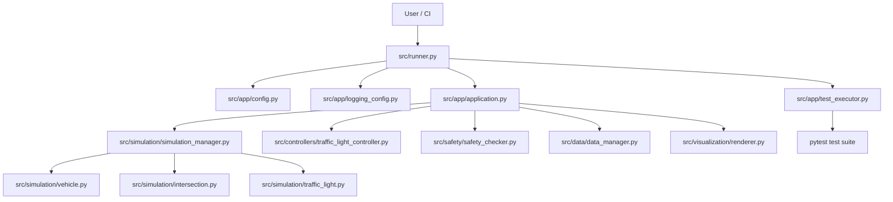
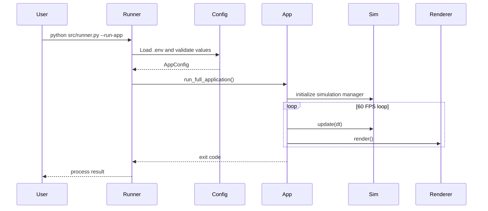

# Crossroads Traffic Light Simulation

> A realistic, configurable traffic-intersection simulator with a professional CLI runner, secure configuration handling, and a categorized automated test suite.

```text
  ____                              ____                 _
 / ___|_ __ ___  ___ ___ _ __ ___ / ___| _   _ _ __ ___| |_
| |   | '__/ _ \/ __/ __| '__/ _ \\___ \| | | | '__/ __| __|
| |___| | | (_) \__ \__ \ | | (_) |___) | |_| | | | (__| |_
 \____|_|  \___/|___/___/_|  \___/|____/ \__,_|_|  \___|\__|
```


Quick links: [Documentation](docs/ci_cd_suggestions.md) | [Architecture](#4-architecture--how-it-works) | [Issues](../../issues) | [Contributing](#15-contributing-guidelines)

## 1. Overview

### What is this project?
This project simulates traffic flow at a four-way intersection with vehicle spawning, signal control algorithms, safety checking, pedestrian logic, and data export support.

### Problem Statement
Traffic behavior is difficult to evaluate safely in real-world environments. Teams need a repeatable simulation environment to test light-control policies, inspect congestion patterns, and validate safety behavior without physical infrastructure changes.

### Solution
The simulator combines:
- Pluggable traffic light control algorithms
- Real-time rendering in Pygame
- Data persistence and scenario export
- Structured runner UX for both app execution and test orchestration
- Security-aware startup configuration and validation

### Key Features
- Interactive menu-driven runner with colored terminal output
- Non-interactive CLI flags for automation
- Environment-based configuration validation at startup
- Simulation lifecycle orchestration with robust exception handling
- Categorized tests: unit, integration, functional, performance, security
- CI pipeline with formatting, linting, type checks, and tests

### Use Cases
- Academic and training demonstrations for traffic flow and control strategies
- Regression testing of algorithm changes in a deterministic workflow
- Rapid prototyping of safety and congestion-related features
- CI-backed quality gates for simulation codebases

## 2. Table of Contents

- [1. Overview](#1-overview)
- [2. Table of Contents](#2-table-of-contents)
- [3. Prerequisites](#3-prerequisites)
- [4. Architecture & How It Works](#4-architecture--how-it-works)
- [5. Project Structure](#5-project-structure)
- [6. Technology Stack](#6-technology-stack)
- [7. Installation Guide](#7-installation-guide)
- [8. Configuration](#8-configuration)
- [9. Usage Guide](#9-usage-guide)
- [10. Testing Documentation](#10-testing-documentation)
- [11. API Documentation](#11-api-documentation)
- [12. Troubleshooting](#12-troubleshooting)
- [13. Performance & Optimization](#13-performance--optimization)
- [14. Security Considerations](#14-security-considerations)
- [15. Contributing Guidelines](#15-contributing-guidelines)
- [16. Roadmap](#16-roadmap)
- [17. License](#17-license)
- [18. Credits & Acknowledgments](#18-credits--acknowledgments)
- [19. Contact & Support](#19-contact--support)
- [20. Author](#20-author)

## 3. Prerequisites

### System Requirements
- OS: Windows 10/11, macOS, or Linux
- CPU: 2+ cores recommended
- RAM: 4 GB minimum, 8 GB recommended
- GPU: Any GPU supported by SDL/Pygame (basic acceleration is enough)

### Required Software
- Python 3.11+ recommended (project currently validated with 3.11.9)
- pip (latest recommended)
- Git (for cloning and contribution workflows)

### Access Requirements
- No cloud account is required for local simulation.
- Optional secret values can be provided through environment variables for extended integrations.

### Knowledge Prerequisites
- Basic Python and command-line usage
- Familiarity with pytest is helpful for contributors

## 4. Architecture & How It Works

### A. High-Level Architecture



### Component Interaction Flow
1. Runner starts and validates configuration.
2. Logging is initialized based on configured log level.
3. User chooses simulation or a test mode.
4. For simulation mode, the app composes controller, safety checker, manager, renderer, and data manager.
5. For test mode, runner delegates to TestExecutor, which invokes pytest subprocesses with coverage reporting.

### Data Flow Explanation
- Runtime inputs: keyboard/mouse events + environment configuration.
- Processing: simulation update loop computes light changes, vehicle movement, and analytics.
- Outputs: rendered frames, scenario files, export JSON, logs, and test reports.

### Request/Response Lifecycle (CLI-driven app)
1. Request: user command (for example `--integration-tests`)
2. Validation: parser + configuration checks
3. Execution: selected workflow runs
4. Response: exit code + terminal summary table/log output

### B. Technical Flow



### Algorithm Notes
- Traffic control modes include time-based and adaptive styles in controller logic.
- Safety checker enforces conflict prevention across direction pairs.
- Simulation manager orchestrates spawn rates, movement updates, events, and analytics.

### State Management
- Stateful runtime objects: `SimulationManager`, `TrafficLightController`, `Renderer`.
- Immutable validated configuration object: `AppConfig` dataclass.

## 5. Project Structure

```text
project/
├── .github/workflows/ci.yml              # CI pipeline for lint, type-check, and test
├── docs/
│   ├── ai_ready_upgrade_plan.md           # Existing planning document
│   └── ci_cd_suggestions.md               # CI/CD implementation recommendations
├── src/
│   ├── main.py                            # Legacy-compatible app entrypoint
│   ├── runner.py                          # Interactive and CLI runner
│   ├── app/
│   │   ├── application.py                 # Simulation bootstrap and runtime loop
│   │   ├── config.py                      # Environment loading and validation
│   │   ├── logging_config.py              # Logging setup abstraction
│   │   ├── test_executor.py               # Pytest subprocess orchestration
│   │   └── exceptions.py                  # App-level exceptions
│   ├── controllers/                       # Traffic signal algorithms
│   ├── data/                              # Persistence helpers and data models
│   ├── safety/                            # Safety rule validation
│   ├── simulation/                        # Core simulation engine entities
│   └── visualization/                     # Pygame rendering and UX layer
├── tests/
│   ├── conftest.py                        # Shared fixtures and test path setup
│   ├── unit/                              # Isolated logic tests
│   ├── integration/                       # Component interaction tests
│   ├── functional/                        # End-to-end workflow tests
│   ├── performance/                       # Runtime and throughput checks
│   └── security/                          # Secret-handling and scan-style checks
├── .env.example                           # Template for runtime configuration
├── .pre-commit-config.yaml                # Local code quality hooks
├── pyrightconfig.json                     # Type analysis paths and include rules
├── pytest.ini                             # Pytest settings and markers
├── requirements.txt                       # Runtime dependencies
├── requirements-dev.txt                   # Development/test tool dependencies
└── README.md                              # Definitive project guide
```

### Why these directories exist
- `src/app/`: centralizes orchestration concerns (config, logging, runner test execution).
- `src/simulation/`: isolates domain mechanics and state transitions.
- `src/visualization/`: keeps rendering logic independent from simulation state updates.
- `tests/`: enforces test intent separation by category for maintainability.
- `docs/`: keeps operational documentation discoverable and versioned.

## 6. Technology Stack

### Programming Language

| Tool | What it is | What it does here | Why it is used | Alternatives considered | Key features utilized |
|---|---|---|---|---|---|
| [Python 3.11](https://docs.python.org/3/) | General-purpose language | Powers simulation, runner, tests, and tooling scripts | Fast iteration, readable code, rich ecosystem | Java, C#, Rust | Dataclasses, typing, stdlib subprocess/logging/pathlib |

### Frameworks & Core Libraries

| Tool & Version | What it is | What it does here | Why it is used | Alternatives considered | Key features utilized |
|---|---|---|---|---|---|
| [Pygame 2.5.2](https://www.pygame.org/docs/) | SDL-based Python game/graphics library | Renders simulation scene and handles input events | Mature, easy 2D rendering/event loop | Arcade, Panda3D, pyglet | Display surface, event queue, frame timing |
| [NumPy 1.26.0](https://numpy.org/doc/) | Numerical computing library | Supports efficient numeric operations in simulation-related computations | Performance and standard scientific API | Pure Python lists, SciPy stack-only | Vectorized math operations |
| [PyMunk 6.6.0](https://www.pymunk.org/en/latest/) | 2D physics wrapper around Chipmunk | Available for physics-based simulation extensions | Accurate and flexible physics primitives | Box2D, custom physics | Physics engine integrations (extensible) |
| [Pillow 10.0.1](https://pillow.readthedocs.io/) | Image processing library | Supports image and asset-related processing workflows | Reliable imaging support | OpenCV, imageio | Image reading/writing transforms |
| [Rich 13.9.4](https://rich.readthedocs.io/) | Terminal formatting library | Styled menu/output tables for runner UX | Better DX than plain print statements | colorama-only, textual | Prompt, table, panel formatting |

### Configuration & Secrets

| Tool & Version | What it is | What it does here | Why it is used | Alternatives considered | Key features utilized |
|---|---|---|---|---|---|
| [python-dotenv 1.0.1](https://saurabh-kumar.com/python-dotenv/) | Environment variable loader | Loads `.env` values during startup | Keeps sensitive config outside code | pydantic-settings, dynaconf | `.env` loading with override control |
| OS environment variables | Platform standard config mechanism | Holds runtime mode and secrets | OWASP-aligned secret externalization | Hardcoded constants (rejected) | Runtime injection, CI secret integration |

### Testing & Quality Assurance

| Tool & Version | What it is | What it does here | Why it is used | Alternatives considered | Key features utilized |
|---|---|---|---|---|---|
| [pytest 8.3.5](https://docs.pytest.org/) | Testing framework | Executes all test categories | Concise, powerful plugin ecosystem | unittest only | Markers, fixtures, assertion introspection |
| [pytest-cov 6.1.1](https://pytest-cov.readthedocs.io/) | Coverage plugin for pytest | Produces terminal/XML coverage reports | Direct CI integration | coverage.py manual invocation | `--cov`, term-missing, XML output |
| [pytest-mock 3.14.0](https://pytest-mock.readthedocs.io/) | Mocking helpers plugin | Simplifies mocking subprocess and dependencies | Cleaner mocking in pytest idioms | unittest.mock only | `mocker` fixture |
| [black 24.10.0](https://black.readthedocs.io/) | Formatter | Enforces consistent formatting | Low style debate, high consistency | autopep8, yapf | Deterministic formatting |
| [flake8 7.1.1](https://flake8.pycqa.org/) | Linter | Style and quality checks | Lightweight and widely adopted | ruff, pylint-only | Rule-based lint checks |
| [mypy 1.15.0](https://mypy.readthedocs.io/) | Static type checker | Validates type contracts | Better correctness and maintainability | pyright only | Type-checking for src/tests |
| [pylint 3.3.6](https://pylint.pycqa.org/) | Advanced linter | Additional code quality guardrails | Rich diagnostics and conventions | flake8-only | Structural/code smell checks |
| [pre-commit 4.2.0](https://pre-commit.com/) | Git hook manager | Runs checks before commit | Prevents low-quality commits from landing | manual local checks | Multi-tool hook orchestration |

### DevOps & CI/CD

| Tool | What it is | What it does here | Why it is used | Alternatives considered | Key features utilized |
|---|---|---|---|---|---|
| [GitHub Actions](https://docs.github.com/actions) | CI/CD automation platform | Runs lint/type/test pipeline on PRs/pushes | Native GitHub integration | GitLab CI, Jenkins | Matrix-ready workflow, hosted runners |

### Development Tooling

| Tool | What it is | What it does here | Why it is used | Alternatives considered | Key features utilized |
|---|---|---|---|---|---|
| `pip` | Python package manager | Installs runtime and dev dependencies | Ubiquitous and simple | poetry, pipenv, uv | requirements file workflows |
| virtualenv / `.venv` | Isolated environment | Reproducible local dependency set | Prevents global package conflicts | conda, poetry-managed env | Local activation and script execution |
| VS Code + Pylance | IDE + language tooling | Productivity, completion, diagnostics | Team standard and strong Python support | PyCharm, Vim LSP | IntelliSense, type diagnostics |

### Database & Storage

This project currently uses file-based JSON persistence through `DataManager` rather than a relational/NoSQL database.

| Storage Approach | Why chosen | Alternatives |
|---|---|---|
| JSON files in `data/` | Simple, transparent, easy diff/debug for simulation scenarios/results | SQLite, PostgreSQL, Redis-backed state |

### Documentation & Diagramming

| Tool | Usage |
|---|---|
| Markdown | Human-readable project documentation |
| Mermaid | Architecture and workflow diagrams |

## 7. Installation Guide

### A. Clone Repository

```bash
git clone <your-repo-url>
cd "Git Hub Copilot Training"
```

### B. Create Virtual Environment

```powershell
python -m venv .venv
& ".\.venv\Scripts\Activate.ps1"
```

### C. Install Dependencies

```powershell
pip install -r requirements.txt
pip install -r requirements-dev.txt
```

### D. Configure Environment Variables

```powershell
Copy-Item .env.example .env
```

Edit `.env` values as needed.

### E. Verify Installation

```powershell
python .\src\runner.py --help
python -m pytest -q
```

### Development Setup vs Production Setup

<details>
<summary>Development setup</summary>

- Install both runtime and dev dependencies.
- Enable pre-commit hooks.
- Run full tests + static checks before PR.

```powershell
pre-commit install
pre-commit run --all-files
```

</details>

<details>
<summary>Production-oriented setup</summary>

- Install only runtime dependencies.
- Provide environment variables from secure store.
- Run app via non-interactive command.

```powershell
pip install -r requirements.txt
python .\src\runner.py --run-app
```

</details>

## 8. Configuration

### Environment Variables

| Variable | Required | Default | Description | Validation |
|---|---|---|---|---|
| `APP_ENV` | No | `development` | Runtime mode | Must be one of `development`, `test`, `production` |
| `APP_DATA_DIR` | No | `data` | Root folder for scenario/export persistence | Must be a valid path |
| `APP_LOG_LEVEL` | No | `INFO` | Logging level | Must be `DEBUG`, `INFO`, `WARNING`, `ERROR`, `CRITICAL` |
| `TEST_TIMEOUT_SECONDS` | No | `240` | Timeout for pytest subprocess execution | Must be positive integer |
| `ENABLE_REMOTE_METRICS` | No | `false` | Toggle for remote metrics behavior | Parsed as boolean true/false-like values |
| `TELEMETRY_API_KEY` | Conditional | Empty | Secret key for telemetry integration | Required when `ENABLE_REMOTE_METRICS=true` |
| `DATABASE_PASSWORD` | No | Empty | Placeholder secret for DB integration | Optional, never logged directly |

### Security Settings
- Secrets are never hardcoded in source.
- `safe_summary()` exposes secret presence flags, not secret values.
- `.env` is ignored by `.gitignore`.

### Feature Flags
- `ENABLE_REMOTE_METRICS`: toggle optional integration behavior.

### Customization
- Adjust logging verbosity with `APP_LOG_LEVEL`.
- Change data output location with `APP_DATA_DIR`.
- Tune CI reliability using `TEST_TIMEOUT_SECONDS`.

## 9. Usage Guide

### A. Quick Start

```powershell
& ".\.venv\Scripts\Activate.ps1"
python .\src\runner.py
```

Choose option `1` to start the full simulation.

Expected behavior:
- Colored menu in terminal
- Pygame simulation window opens
- Keyboard/mouse controls available in visualization layer

### B. Detailed Usage

#### Interactive Menu Mode
```powershell
python .\src\runner.py
```

Menu options:
1. Run Full Application
2. Run Unit Tests
3. Run Integration Tests
4. Run All Tests
5. Exit

#### CLI Flags
```powershell
python .\src\runner.py --run-app
python .\src\runner.py --unit-tests
python .\src\runner.py --integration-tests
python .\src\runner.py --all-tests
python .\src\runner.py --help
```

#### Legacy Entrypoint (Compatibility)
```powershell
python .\src\main.py
```

#### Typical Contributor Workflow
```powershell
python -m pytest -q
pre-commit run --all-files
```

## 10. Testing Documentation

### Test Categories
- Unit: isolated behavior and validation logic
- Integration: cross-component interactions
- Functional: user-facing runner workflows
- Performance: critical operation timing checks
- Security: secret-handling and source checks

### Run Tests

```powershell
python -m pytest -m unit
python -m pytest -m integration
python -m pytest -m functional
python -m pytest -m performance
python -m pytest -m security
python -m pytest -ra --cov=src --cov-report=term-missing
```

### Understanding Output
- `PASSED`: assertion expectations met
- `FAILED`: assertion mismatch
- `ERROR`: setup/import/runtime failure in test execution
- Coverage report: displays uncovered lines by file

### Writing New Tests
1. Add tests under category folder in `tests/`.
2. Mark with appropriate `pytest.mark.<category>` marker.
3. Reuse shared fixtures from `tests/conftest.py`.
4. Keep tests deterministic and avoid wall-clock flakiness.

## 11. API Documentation

This project does not currently expose HTTP/REST/gRPC endpoints.

If API endpoints are added in future versions, this section should include:
- Endpoint catalog
- Request/response schemas
- Authentication model
- Error code map

## 12. Troubleshooting

### Common Issues

| Issue | Likely cause | Resolution |
|---|---|---|
| `No module named pytest` | Dev dependencies not installed in active environment | `pip install -r requirements-dev.txt` |
| Pygame window not opening | Headless/unsupported display environment | Run on local desktop session or configure display forwarding |
| `Configuration error: ...` | Invalid `.env` value | Correct variable based on validation rules in this README |
| Slow test startup | Cold environment, dependency load | Reuse virtual environment and run selective markers |

### Debugging Tips
- Use `APP_LOG_LEVEL=DEBUG` to increase runtime signal.
- Run targeted tests with a marker for faster feedback.
- Inspect generated data files in `data/` to validate state outputs.

### FAQ

<details>
<summary>Can I run only integration tests from the menu?</summary>

Yes. Start `python src/runner.py` and choose option `3`.

</details>

<details>
<summary>Do I need real API keys to run locally?</summary>

No. Only set `TELEMETRY_API_KEY` when `ENABLE_REMOTE_METRICS=true`.

</details>

## 13. Performance & Optimization

### Performance Characteristics
- Main simulation loop targets approximately 60 FPS (`clock.tick(60)`).
- Test executor captures longest test durations (`--durations=10`).
- Performance tests include timing checks for hot-path operations.

### Optimization Tips
- Keep rendering and simulation logic separated.
- Use marker-based test subsets during iterative development.
- Profile large modules (renderer/vehicle dynamics) before micro-optimizing.

### Scalability Considerations
- Current architecture is single-process, single-intersection focused.
- Future scaling could isolate simulation engine from rendering and support batched scenario execution.

## 14. Security Considerations

### Implemented Practices
- Environment-variable based secret handling
- Startup validation for critical config combinations
- Redacted secret summaries in logs
- Security-category tests for obvious hardcoded-secret patterns

### Deployment Recommendations
- Store secrets in CI/CD secret managers or vault services.
- Do not mount plaintext `.env` files in shared production environments.
- Rotate credentials regularly and on team membership changes.

### Known Considerations
- This is a local simulation app, not an externally exposed service.
- If remote integrations are added, include authentication, transport encryption, and threat modeling updates.

## 15. Contributing Guidelines

### How to Contribute
1. Fork and create a feature branch.
2. Implement change with tests.
3. Run quality checks and test suite.
4. Open a pull request with clear summary and rationale.

### Code Style
- Follow PEP 8
- Use type hints in new/modified code
- Add concise docstrings and comments for complex logic

### Pull Request Checklist
- [ ] Tests added/updated
- [ ] `pytest` passes
- [ ] `black`, `flake8`, `mypy`, `pylint` pass
- [ ] No secrets committed
- [ ] Documentation updated if behavior changed

### Issue Reporting
Include:
- Steps to reproduce
- Expected vs actual behavior
- Environment details (OS, Python version)
- Relevant logs/screenshots

## 16. Roadmap

### Planned Improvements
- Increase total coverage toward 80%+
- Expand algorithm benchmarking scenarios
- Add richer analytics export and comparison tooling
- Improve renderer testability with more decoupled view-model patterns

### Known Limitations
- No network API layer currently
- Heavy rendering module has low automated coverage
- Performance metrics are primarily local and synthetic

## 17. License

This project is licensed under the MIT License.

See [LICENSE](LICENSE) for full text and permissions.

## 18. Credits & Acknowledgments

- Project maintainers and contributors
- Open-source maintainers of Pygame, pytest, Rich, and related tooling
- Community guidance around Python testing and secure configuration practices

## 19. Contact & Support

### Get Help
- Open an issue in the repository issue tracker
- Review troubleshooting and testing sections first for common failures

### Report Bugs / Request Features
- Use issue templates when available
- Provide reproducible context and logs

### Communication
- Primary channel: repository issues and pull request discussion

## 20. Author

## 👤 Author

**Created by Mohammad Ali Shikhi**

- LinkedIn: [Profile Link](https://www.linkedin.com/in/mohammad-ali-shikhi/)

